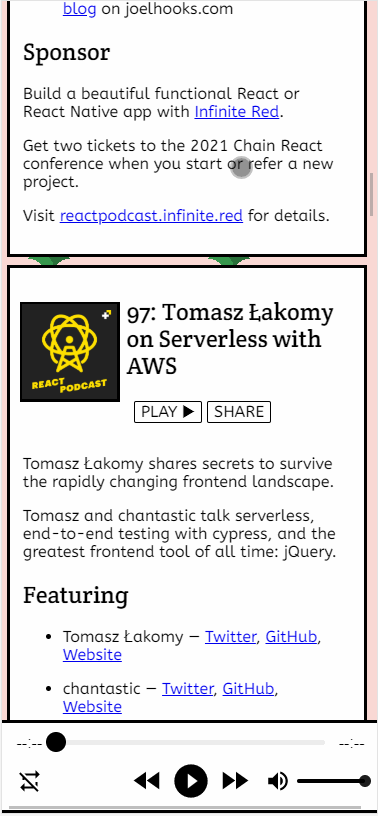

# RSS Client

****** **[App is available here](https://rssclient.netlify.app)** ******

This peoject started as a humble POC to test out various RSS to JSON libraries and now has evolved to a fully functioning RSS client with fuzzy search with back end support to store podcast history (Cloud Sync). The commits in this repository show how I have evolved from a beginner front-end dev. It initially had material UI as the front end components library, which I scrapped in favour to create a styling system of my own (and I intend to keep it that way). It is based on react-boilerplate, but as the boilerplate mentions, this project doesn't justify using such as powerful boilerplate, in short, This was a poor decision which has added uneeded complexity, I would be happy if anyone would want to collaborate with me to port this project to create-react-app (we will set up PWA, styled components from scratch).

## Tech Stack

At present, the following libraries are used :

- React
- [react-boilerplate related libraries](https://github.com/react-boilerplate/react-boilerplate/blob/master/docs/general/introduction.md#tech-stack)
- [axios](https://github.com/axios/axios)
- [fuse.js](https://fusejs.io/)
- [react-h5-audio-player](https://www.npmjs.com/package/react-h5-audio-player)
- [rss-parser](https://www.npmjs.com/package/rss-parser)

The back-end is [here](https://github.com/98lenvi/rss_client_backend) and is a Node.js serverless application (lambda) on AWS and the database is MongoDB. It is not very sophisicated and can be understood with basic javascript knowledge (The front-end is complex).

## Features

- Search (using Fuse.js).
- Sync history to cloud (using email, there is no authentication as of now).
- PWA support (Title changes according to file being played).
- Completely responsive.
- Share by episode
- Simple to use, light, fast & no mandatory login 😇 

## Demo
[click here](https://rssclient.netlify.app)

## How to run the project?

First, clone the repository by typing the below into the terminal:

`git clone https://github.com/98lenvi/my_rss_client`

 `cd ./my_rss_client/`

Open the terminal in the root of the project, and type the following :

 
 `yarn`
 
 `yarn start`
 

Then, open your favourite browser and open this [link](http://127.0.0.1:3000) for the app .

## Hey there!

If you've made it to the end, it looks like you are interested in contributing, I have following ideas to be added and would love a (or few) hands to help.
It's okay if you don't understand the project, we can have a discussion and help you to get started on this repo! (Provided you know some JS)

- Dark mode.
- Store RSS data locally instead of fetching everytime.
- Add loading & error state (loading is partially done).
- Better share experience.
- Backend can have improvements (better CORS headers).
- Commit & Contribution rules can be defined.
- Documentation enchancements (Grammar, spelling included)

## Contributing guidlines

Always PLEASE create an issue first before making (or even thinking of) a PR 😁
